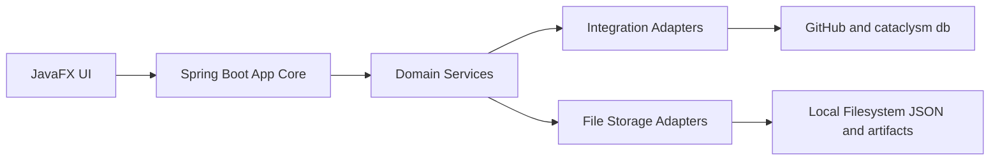

# Launcher Migration Plan: Python Tkinter to Java Spring Boot and JavaFX

## Overall Reimplementation Plan

### Migration goals

- Reimplement the launcher on Java with a maintainable modular architecture and clear boundaries between UI, orchestration, domain logic, integrations, and persistence.
- Deliver user value early by prioritizing core player workflows first: release discovery, download and install, activation, and launch resume.
- Preserve operational reliability by keeping file-based persistence in the first implementation, with explicit schema versioning and migration safeguards.
- Reduce platform and maintenance risk by replacing tightly coupled Tkinter controller logic with testable service-oriented modules.

### Target high-level architecture

- **JavaFX Desktop Client**
  - Owns presentation, interaction state, user workflows, progress feedback, and local status views.
- **Spring Boot Application Core**
  - Hosts business services, workflow orchestration, integration clients, persistence adapters, and lifecycle wiring.
  - Runs embedded within the desktop process as the internal application framework, not as a remote web server dependency.
- **Domain Services Layer**
  - Release Catalog Service
  - Installation and Activation Service
  - Launch Runtime Service
  - Backup Service
  - Settings and Configuration Service
- **Integration Adapters**
  - GitHub Releases client
  - cataclysm-db client
  - Download and artifact management adapter
- **Persistence and Filesystem Layer**
  - JSON metadata and local filesystem artifacts
  - Versioned schema for settings, release cache metadata, installation metadata, and backup metadata

### Module boundaries and responsibilities

- `launcher-ui-javafx`: JavaFX views, view models, workflow state, UI events.
- `launcher-app-core`: Spring Boot configuration, dependency wiring, use-case orchestration.
- `launcher-domain`: Domain models and service interfaces.
- `launcher-integration`: External API clients and protocol translation.
- `launcher-storage-file`: File-based repositories, cache, metadata versioning, migration utilities.
- `launcher-platform`: Process launch abstraction and OS-specific behaviors.

### Integration and data flow strategy

- UI invokes application use cases through explicit service interfaces.
- Domain services orchestrate remote metadata fetch, local caching, and install workflows.
- Integration adapters normalize upstream payloads into internal release models.
- Storage adapters own read and write operations and enforce metadata schema version rules.
- Eventing is simplified to typed application events and UI observer updates instead of broad global signaling.

### Key assumptions and dependencies

- Existing external endpoints remain available and broadly compatible with current integration behavior.
- Linux and Windows remain primary supported platforms for first release.
- Legacy data under user launcher directories remains accessible for one-time import and ongoing compatibility where feasible.
- Packaging pipeline will move from Python specific tooling to Java runtime packaging tooling, treated as a dedicated delivery track.

## System-by-System Plans

### 1. App bootstrap and lifecycle

- **Legacy scope**: `YACLApplication`, startup wiring, shutdown flow.
- **Classification**: **Redesigned**.
- **Plan**:
  - Replace ad hoc startup sequencing with Spring-managed lifecycle and explicit startup phases.
  - Introduce startup health checks for filesystem readiness, settings load, and optional remote connectivity.
  - Add fail-safe degraded mode for offline and partial initialization scenarios.
- **Why**: Current bootstrap is a high-coupling point. Managed lifecycle improves reliability, testability, and extensibility.

### 2. Window shell, tabs, dialogs

- **Legacy scope**: Tk root window, tab container, game and backup and settings tabs, dialogs.
- **Classification**: **Redesigned**.
- **Plan**:
  - Rebuild shell in JavaFX with explicit view models and state-driven UI updates.
  - Consolidate progress and status messaging into reusable JavaFX components.
  - Preserve core workflow affordances while modernizing interaction patterns.
- **Why**: Tkinter view and controller coupling is hard to evolve. JavaFX enables cleaner separation and richer UX consistency.

### 3. Game workflow orchestration

- **Legacy scope**: Search releases, choose assets, install, activate, launch or resume.
- **Classification**: **Kept and Redesigned**.
- **Plan**:
  - Keep end-to-end player workflow outcomes.
  - Redesign orchestration as distinct use cases with explicit state transitions and recoverable steps.
  - Introduce operation journal entries for install and activation to support interruption recovery.
- **Why**: This is the highest user-value path and must be first-class in early phases.

### 4. Release discovery and metadata

- **Legacy scope**: GitHub plus cataclysm-db retrieval, cache fallback, release filtering and search.
- **Classification**: **Kept and Merged**.
- **Plan**:
  - Keep both integration sources.
  - Merge release normalization and search into a single Release Catalog subsystem.
  - Standardize cache freshness policy and stale-data behavior with explicit policy configuration.
- **Why**: A unified catalog boundary reduces duplicate logic and clarifies integration contracts.

### 5. Download and install pipeline

- **Legacy scope**: Artifact download, extraction, metadata write, active install switching.
- **Classification**: **Kept and Redesigned**.
- **Plan**:
  - Keep functional intent.
  - Redesign as staged pipeline with checkpoints: fetch, validate, extract, register, activate.
  - Ensure idempotent cleanup and resume-safe handling after partial failures.
- **Why**: Install operations carry high failure and corruption risk; staged orchestration reduces blast radius.

### 6. Activation and launch runtime

- **Legacy scope**: Active version selection and OS process spawn.
- **Classification**: **Kept and Redesigned**.
- **Plan**:
  - Keep activation semantics and launch resume capabilities.
  - Introduce platform abstraction for executable resolution, arguments, environment setup, and process tracking.
  - Provide clearer launch diagnostics in status logs.
- **Why**: Platform specific behavior should be isolated to maintain cross-platform reliability.

### 7. Backup and restore

- **Legacy scope**: Enumerate, create, delete, restore save backups.
- **Classification**: **Deferred for first release, then Redesigned**.
- **Plan**:
  - Defer full backup UI workflow from earliest delivery phase.
  - Preserve compatibility with existing backup storage layout.
  - Reintroduce with safer preflight checks and restore safeguards.
- **Why**: Lower immediate value than core play workflows, while still important for data safety in follow-on phases.

### 8. Settings and configuration

- **Legacy scope**: Defaults, user settings, reset behavior, cache and DB toggles.
- **Classification**: **Kept and Redesigned**.
- **Plan**:
  - Keep user-facing settings categories needed by core workflows.
  - Redesign config model with explicit schema versioning and migration handlers.
  - Split immutable runtime defaults from mutable user preferences.
- **Why**: Config drift and implicit precedence are common maintenance issues in file-based systems.

### 9. Status logging and diagnostics

- **Legacy scope**: Log bridge to UI status pane.
- **Classification**: **Kept and Merged**.
- **Plan**:
  - Keep user-visible status stream and local logs.
  - Merge launcher events and operational logs into a unified diagnostics service.
  - Add structured event categories for install, integration, and launch troubleshooting.
- **Why**: Better diagnostics improves supportability during migration and rollout.

### 10. Eventing model

- **Legacy scope**: Blinker-based broad event signaling.
- **Classification**: **Removed and Replaced**.
- **Plan**:
  - Remove global signal bus pattern.
  - Replace with typed domain events and scoped observer channels between application core and UI.
- **Why**: Narrow contracts improve readability, testing, and change safety.

### 11. Icon and theming subsystem

- **Legacy scope**: icon service and Tk theme assets.
- **Classification**: **Merged and Partially Removed**.
- **Plan**:
  - Merge icon loading into JavaFX resource management.
  - Remove Tk-specific theming assets and rendering dependencies.
  - Keep only visual resources needed by the new UI style system.
- **Why**: Legacy theme stack is toolkit-specific and not portable to JavaFX.

### 12. Build and release packaging

- **Legacy scope**: setup.py, build.py, Nuitka-based distribution.
- **Classification**: **Removed and Replaced**.
- **Plan**:
  - Replace Python packaging toolchain with Java build and desktop packaging pipeline.
  - Add reproducible build conventions and artifact verification.
- **Why**: Legacy packaging stack is incompatible with target runtime.

## Scope Changes from Legacy

### Feature classification summary

| Legacy capability                     | New treatment            | Rationale                                                             |
| ------------------------------------- | ------------------------ | --------------------------------------------------------------------- |
| Release discovery and search          | Kept and merged          | Core user value, simplified through unified release catalog           |
| Download and install                  | Kept and redesigned      | Critical workflow, needs robust staged execution                      |
| Activation and launch resume          | Kept and redesigned      | Core player workflow with improved platform abstraction               |
| Settings management                   | Kept and redesigned      | Preserve control while improving schema governance                    |
| Status logging in UI                  | Kept and merged          | Essential operator visibility and troubleshooting                     |
| Backup create restore                 | Deferred then redesigned | Important but lower initial delivery priority than install and launch |
| Global event bus pattern              | Removed and replaced     | Reduce coupling and improve testability                               |
| Tk-specific dialogs and tab internals | Removed and replaced     | Reimplemented in JavaFX view model architecture                       |
| Tk theming asset chain                | Removed                  | Non-portable to JavaFX stack                                          |
| Python build and release scripts      | Removed and replaced     | Incompatible with Java runtime toolchain                              |

### Explicit out of first release scope

- Full legacy parity for backup UX and advanced backup operations.
- Broad UI customization beyond core usability and accessibility baseline.
- Non-essential visual parity with legacy theme behavior.

### Compatibility stance

- Preserve existing user data directories where possible.
- Provide import and migration behavior for file-based metadata with version checks.
- Favor forward-compatible schema evolution over exact key-for-key legacy persistence replication.

## Technical Risks and Mitigations

| Risk                                                   | Impact                                      | Mitigation                                                                              |
| ------------------------------------------------------ | ------------------------------------------- | --------------------------------------------------------------------------------------- |
| External API shape drift from GitHub or cataclysm-db   | Release discovery failures                  | Adapter isolation, schema validation, fallback cache policy, contract tests             |
| Partial install failure leading to broken active state | User disruption and support burden          | Staged install checkpoints, transactional metadata updates, cleanup and resume strategy |
| Data migration issues from legacy file formats         | Lost settings or invalid installation state | Versioned schema adapters, dry-run migration mode, backup before write                  |
| Cross-platform launch differences                      | Launch failures on Linux or Windows         | Platform abstraction layer, targeted integration test matrix, diagnostic enrichment     |
| UI responsiveness under long operations                | Poor user experience                        | Background task executor model, progress and cancellation hooks                         |
| Expanding scope toward full parity too early           | Delivery delay and risk concentration       | Strict phased scope gates, defer low-value complexity, acceptance criteria per phase    |
| Packaging transition complexity                        | Slow adoption and unstable releases         | Dedicated packaging workstream, reproducible builds, staged beta rollout                |

## Delivery Phases

### Phase 1: Foundation and vertical slice

- Establish modular project skeleton and core boundaries.
- Implement JavaFX shell and Spring Boot embedded core wiring.
- Deliver one end-to-end vertical slice: release fetch, select, install, activate, launch.
- Keep persistence file-based with versioned metadata foundation.

### Phase 2: Core workflow hardening

- Expand release catalog behavior with cache policy and search quality improvements.
- Harden install pipeline for retries, interruption handling, and rollback semantics.
- Improve diagnostics and status stream consistency.
- Validate Linux and Windows runtime behavior for core operations.

### Phase 3: Settings and migration readiness

- Complete settings workflows and migration from legacy config files.
- Add migration checks for installation metadata compatibility.
- Finalize packaging and upgrade path for controlled user rollout.

### Phase 4: Backup reintroduction and stabilization

- Reintroduce backup and restore workflows with safer UX and guardrails.
- Add backup integrity checks and clearer recovery messaging.
- Close remaining deferred items that materially improve reliability.

### Phase 5: Rollout and legacy retirement

- Run phased rollout channels: internal, limited external, broader release.
- Monitor operational diagnostics and fix high-priority defects quickly.
- Publish migration and rollback guidance.
- Deprecate legacy launcher distribution after stability criteria are met.

### Rollout strategy principles

- Deliver value early through core player workflows before full feature breadth.
- Use progressive exposure to reduce migration risk.
- Keep rollback path available until new launcher proves stability in the field.
- Treat deferred scope explicitly to avoid uncontrolled parity expansion.

### Execution dependencies

- Finalized module ownership and interface contracts.
- Test fixtures for representative legacy data layouts.
- Reliable access to external integration endpoints for pre-release validation.
- Packaging and signing decisions aligned with target distribution channels.
